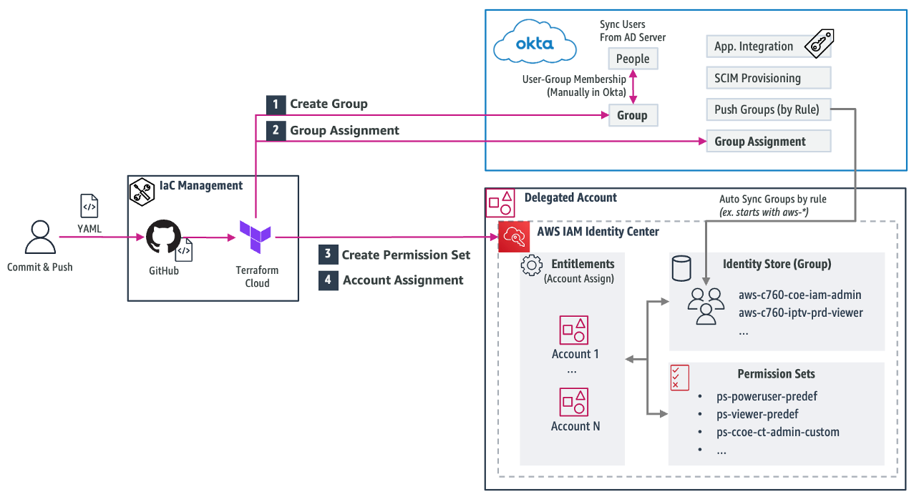
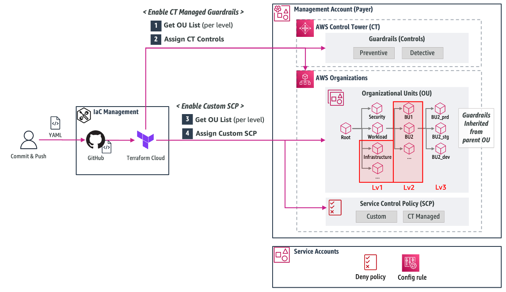

# COE-RESOURCE-MGMT

## Table of content
* [Overview](#overview)
  * [1. 사용자 통합 인증 및 권한 관리](#1-사용자-통합-인증-및-권한-관리)
  * [2. 표준 가드레일 관리](#2-표준-가드레일-관리)
* [Code Structure](#code-structure)
* [References](#references)

## Overview
아래 2가지의 영역을 Terraform 코드로 관리하며 변경(추가/수정/삭제)은 YAML 파일로 진행 합니다.

### 1. 사용자 통합 인증 및 권한 관리
 * Okta Group 생성 및 AWS 사용자 Group에 권한 부여 시 사용 
 * 연관 서비스 
   * AWS IAM Identity Center
   * Okta




### 2. 표준 가드레일 관리
* AWS Control Tower 제공 Controls 또는 AWS Organizations의 Custom SCP(Service Control Policy) 적용
* 전사 표준 가드레일을  OU Level 1, Level 2 단위에 적용하며, 필요 시 Level 3에 추가 적용 
* 연관 서비스
  * AWS Control Tower
  * AWS Organizations




## Code Structure
* `IaC-module` : 공통 모듈 폴더
  * `IAMCenterAdmin`, `Guardrail` 디렉터리는 연관된 서비스의 Terraform Provider 정의 및 Resource를 생성하는 코드를 포함합니다.
  * `modules` 디렉터리는 `IAMCenterAdmin`, `Guardrail` 에서 내부적으로 호출하는 모듈을 정의합니다. 
* `values` : 설정 값을 YAML/JSON 형식으로 정의 (운영 시 사용)
  * 공통 모듈 폴더 `IaC-module` 가 사용하는 실제 설정 값이며, 운영 시 해당 디렉터리만 수정하면 됩니다. 
  * Multi Payer 환경을 고려하여 `Payer 계정 구분`별*로 하위 디렉터리를 관리합니다. (**하위 디렉터리명: Payer MSP 구분자 3자리 + Account ID 앞 3자리*)    
```
.
├── IaC-module   # 공통 모듈 폴더
│    ├── IAMCenterAdmin              # 1. 사용자 통합 인증 및 권한 관리
│    │      ├── CreateGroup          # 1-1. Okta 그룹 생성  
│    │      ├── CreatePermissionSet  # 1-2. 퍼미션셋 생성
│    │      └── GroupAssignment      # 1-3. 그룹 할당 
│    ├── Guardrail                   # 2. 표준 가드레일 관리 
│    │      ├── AssignControls       # 2-1. controls 할당
│    │      └── CustomSCP            # 2-2. custom scp 생성 및 할당
│    └── modules
│           ├── CreateGroup
│           ├── CreatePermissionSet
│           ├── GroupAssignment
│           ├── AssignControls
│           └── CustomSCP
│
└──  values       # 설정 값 정의 폴더 (운영 시 해당 디렉터리만 수정)
     ├── CNS760     # payer 계정 구분
     │     ├── IAMCenterAdmin 
     │     │     ├── PermissionSet         # 퍼미션셋 yaml
     │     │     │     └── inline_policy   # inline policy json  
     │     │     ├── AccountAssign         # 퍼미션셋 할당 yaml
     │     │     └── OktaGroup             # okta group yaml 
     │     └── ControlTowerManagement 
     │           ├── AssignControls        # controls yaml
     │           └── AssignCustomSCP  
     │                 ├── scp_subs        # custom scp json
     │                 └── scp_yamls       # custom scp yaml
     │ 
     ├── payer2    # payer 계정 구분
           ├── IAMCenterAdmin  
           │     └── ...                   
           └── ControlTowerManagement 
                 └── ...
```


## References
* [Okta Provider](https://registry.terraform.io/providers/okta/okta/latest/docs)
* [AWS Provider](https://registry.terraform.io/providers/hashicorp/aws/latest/docs)
* [Vault Provider](https://registry.terraform.io/providers/hashicorp/vault/latest/docs)


